# Mobile Wireframes v1, Mermaid Handoff

## WF-01, Personal Home (Action-First)
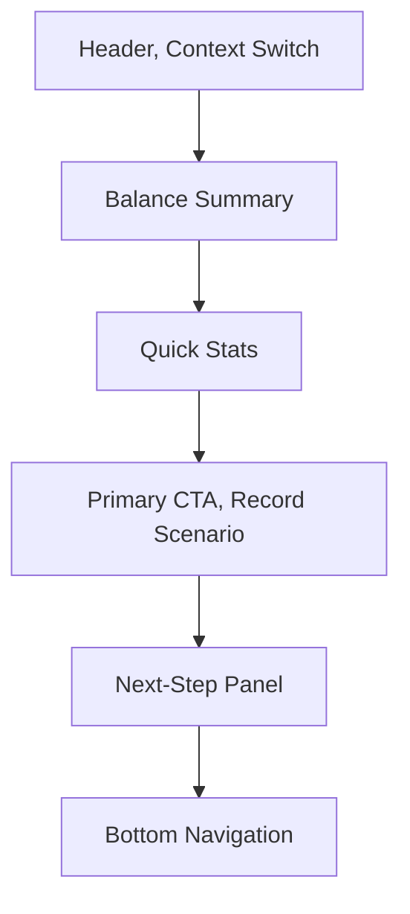
```mermaid
flowchart TD
  A[Header, Context Switch] --> B[Balance Summary]
  B --> C[Quick Stats]
  C --> D[Primary CTA, Record Scenario]
  D --> E[Next-Step Panel]
  E --> F[Bottom Navigation]
```

## WF-02, Scenario Launcher
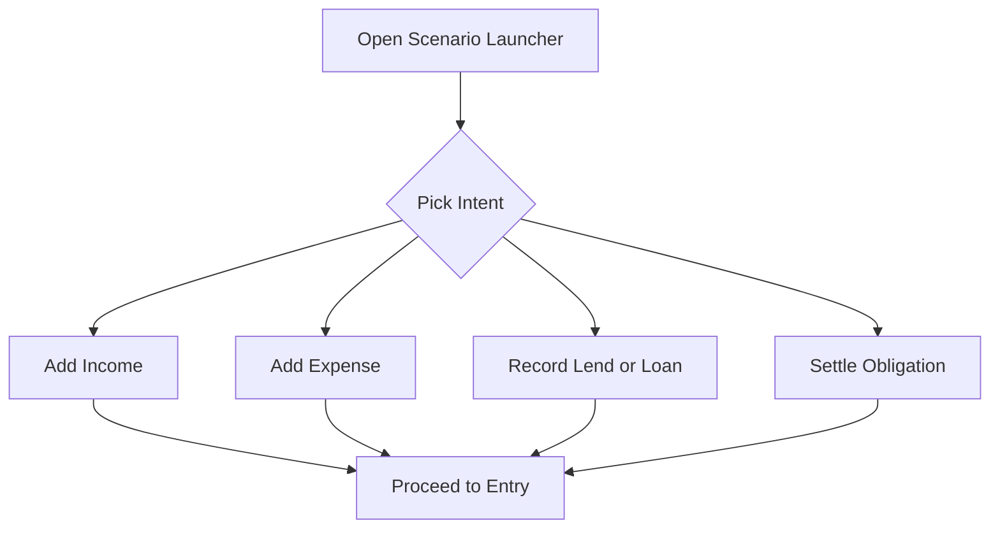
```mermaid
flowchart TD
  A[Open Scenario Launcher] --> B{Pick Intent}
  B --> C[Add Income]
  B --> D[Add Expense]
  B --> E[Record Lend or Loan]
  B --> F[Settle Obligation]
  C --> G[Proceed to Entry]
  D --> G
  E --> G
  F --> G
```

## WF-03, Personal Entry + Impact Preview
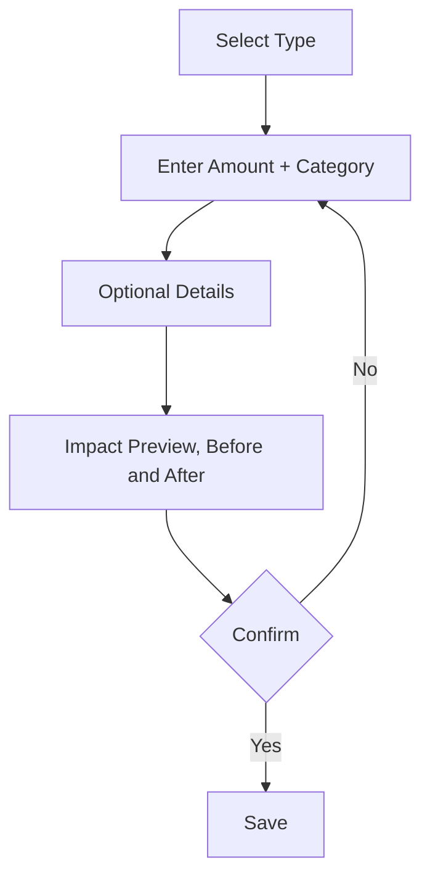
```mermaid
flowchart TD
  A[Select Type] --> B[Enter Amount + Category]
  B --> C[Optional Details]
  C --> D[Impact Preview, Before and After]
  D --> E{Confirm}
  E -- Yes --> F[Save]
  E -- No --> B
```

## WF-04, Success + Next Step
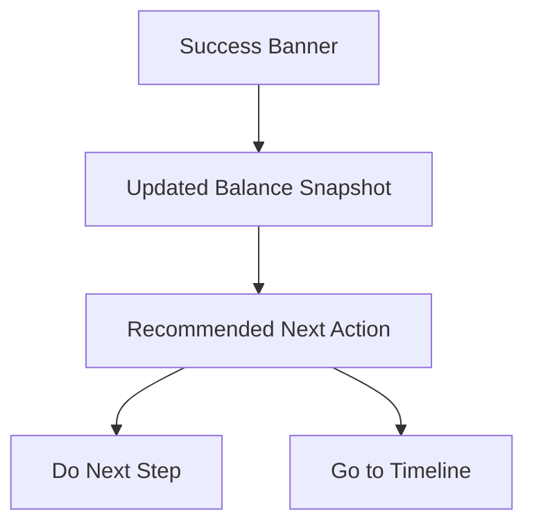
```mermaid
flowchart TD
  A[Success Banner] --> B[Updated Balance Snapshot]
  B --> C[Recommended Next Action]
  C --> D[Do Next Step]
  C --> E[Go to Timeline]
```

## WF-05, Group Home
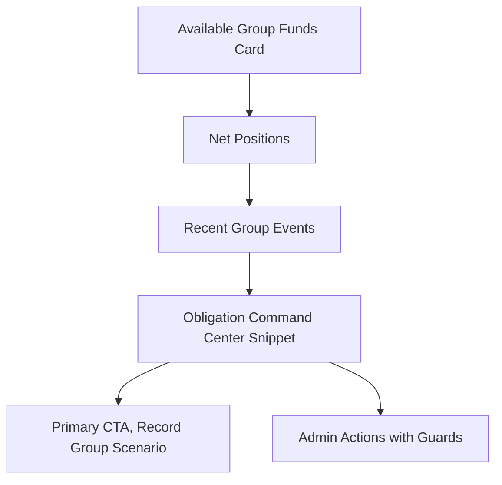
```mermaid
flowchart TD
  A[Available Group Funds Card] --> B[Net Positions]
  B --> C[Recent Group Events]
  C --> D[Obligation Command Center Snippet]
  D --> E[Primary CTA, Record Group Scenario]
  D --> F[Admin Actions with Guards]
```

## WF-06, Group Withdrawal + Explainability
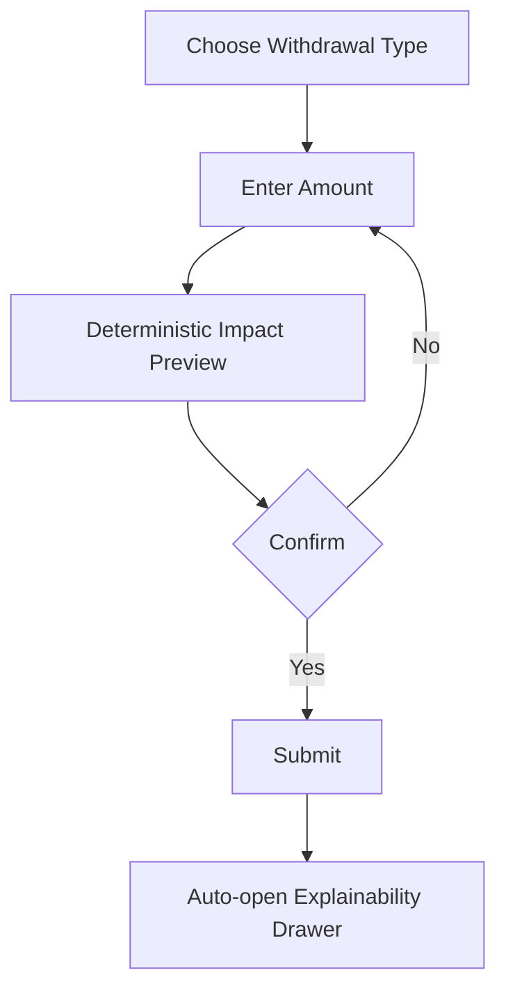
```mermaid
flowchart TD
  A[Choose Withdrawal Type] --> B[Enter Amount]
  B --> C[Deterministic Impact Preview]
  C --> D{Confirm}
  D -- Yes --> E[Submit]
  E --> F[Auto-open Explainability Drawer]
  D -- No --> B
```

## WF-07, Obligations Command Center
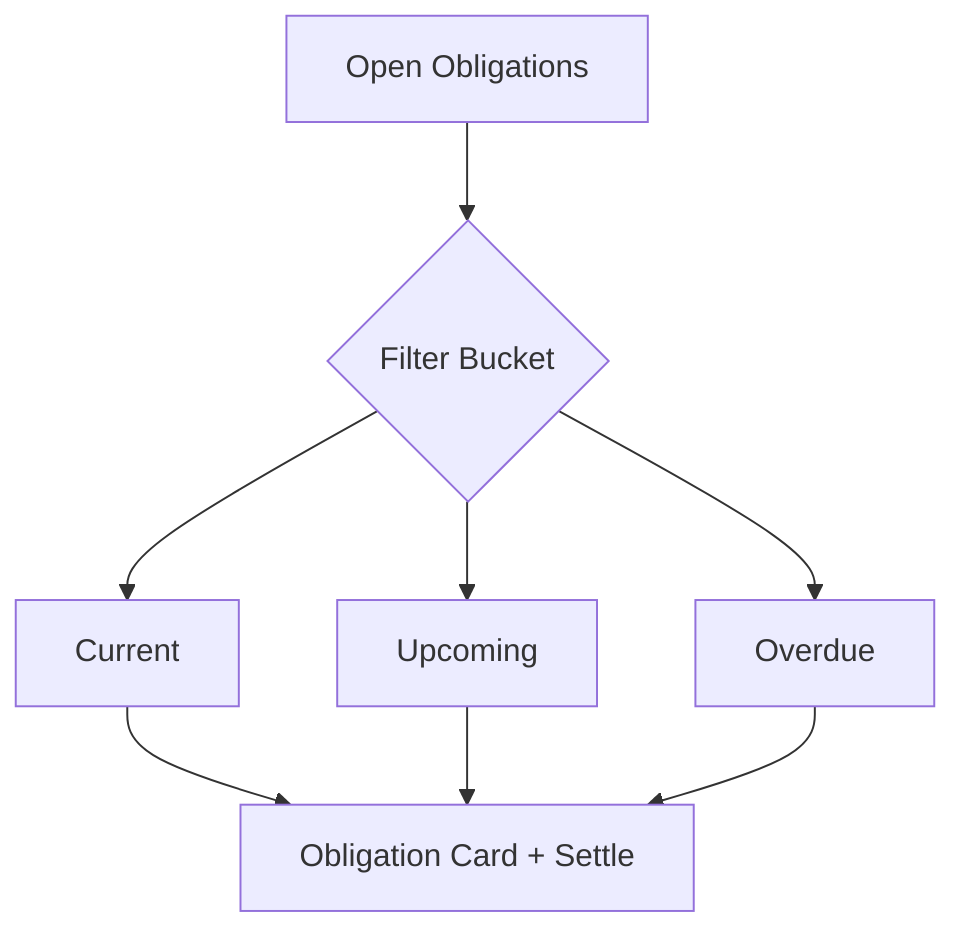
```mermaid
flowchart TD
  A[Open Obligations] --> B{Filter Bucket}
  B --> C[Current]
  B --> D[Upcoming]
  B --> E[Overdue]
  C --> F[Obligation Card + Settle]
  D --> F
  E --> F
```

## WF-08, Explainability Drawer
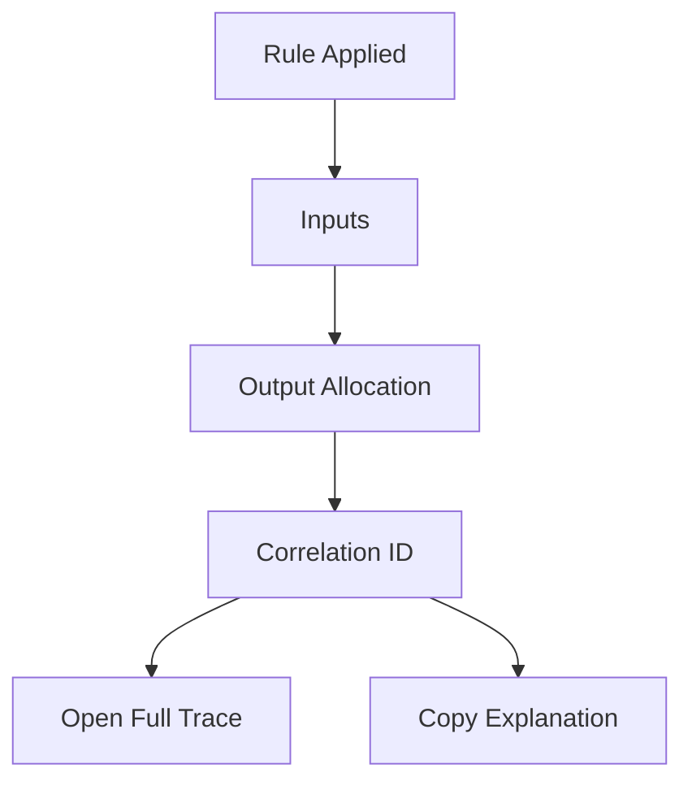
```mermaid
flowchart TD
  A[Rule Applied] --> B[Inputs]
  B --> C[Output Allocation]
  C --> D[Correlation ID]
  D --> E[Open Full Trace]
  D --> F[Copy Explanation]
```

## WF-09, Audit Timeline
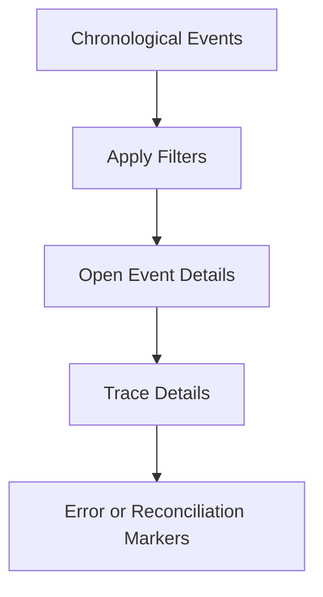
```mermaid
flowchart TD
  A[Chronological Events] --> B[Apply Filters]
  B --> C[Open Event Details]
  C --> D[Trace Details]
  D --> E[Error or Reconciliation Markers]
```

## WF-10, Admin Guarded Goal Implementation
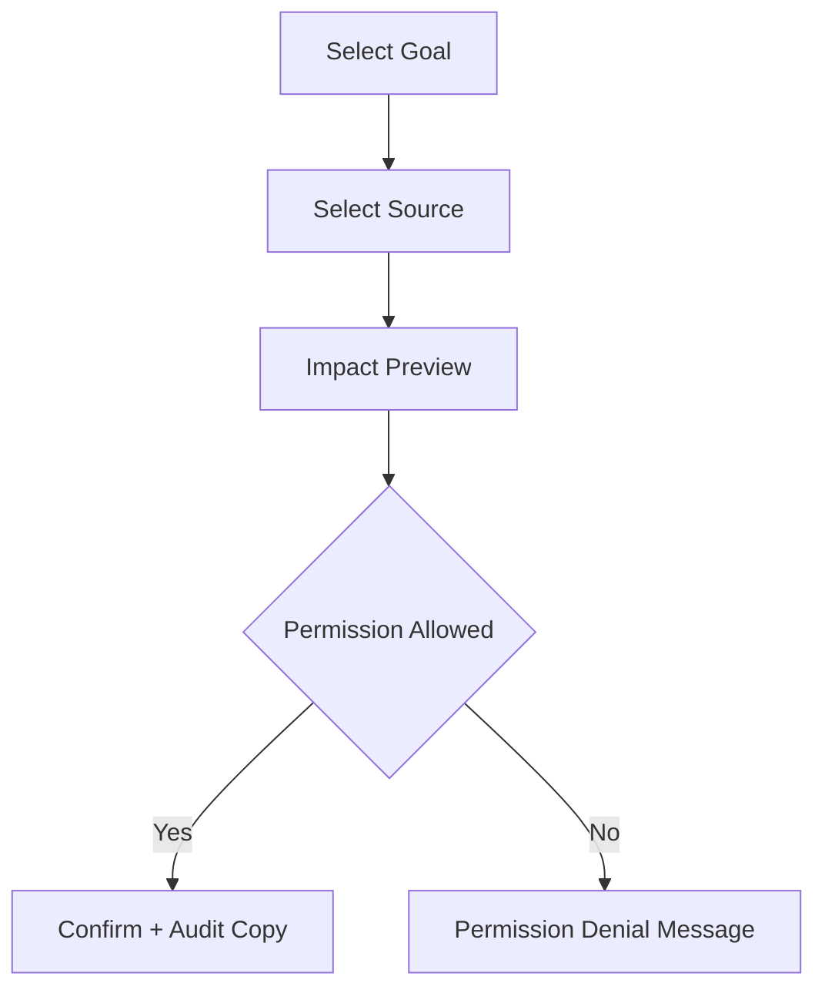
```mermaid
flowchart TD
  A[Select Goal] --> B[Select Source]
  B --> C[Impact Preview]
  C --> D{Permission Allowed}
  D -- Yes --> E[Confirm + Audit Copy]
  D -- No --> F[Permission Denial Message]
```

## WF-17, Group Members Management
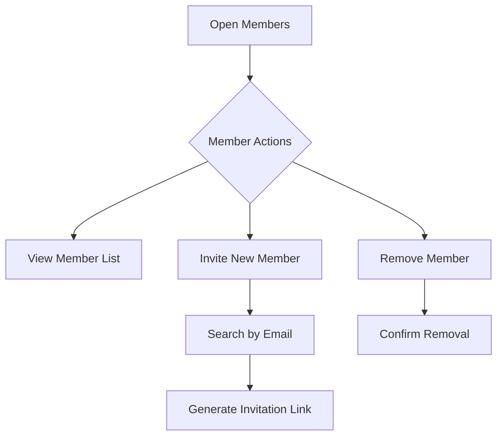
```mermaid
flowchart TD
  A[Open Members] --> B{Member Actions}
  B --> C[View Member List]
  B --> D[Invite New Member]
  D --> E[Search by Email]
  E --> F[Generate Invitation Link]
  B --> G[Remove Member]
  G --> H[Confirm Removal]
```

## WF-18, Policy-Based Access Control (PBAC)
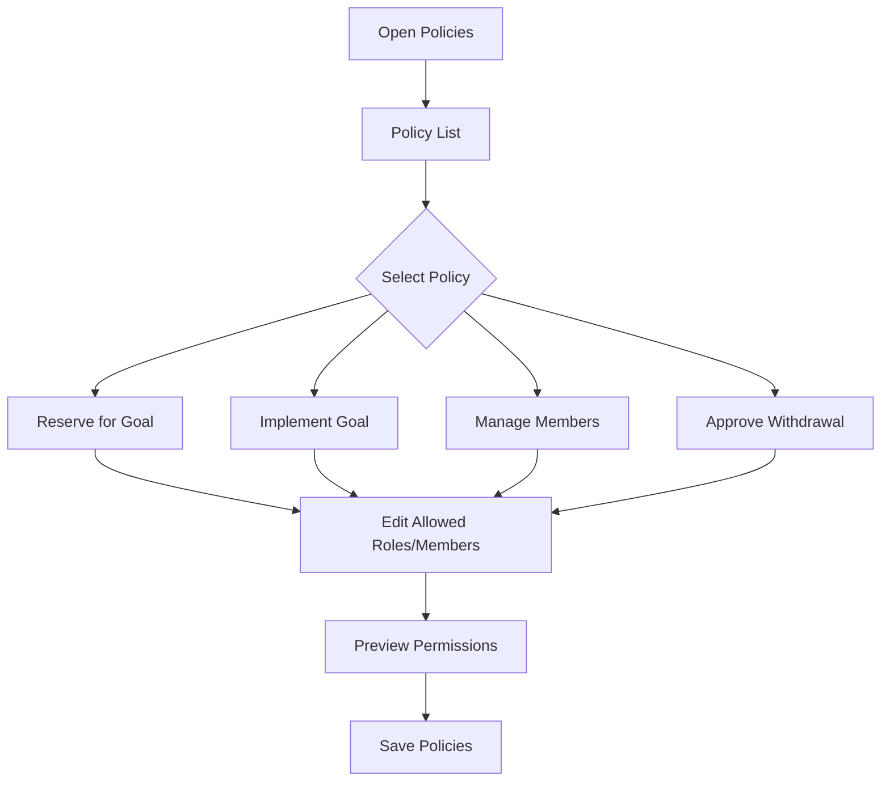
```mermaid
flowchart TD
  A[Open Policies] --> B[Policy List]
  B --> C{Select Policy}
  C --> D[Reserve for Goal]
  C --> E[Implement Goal]
  C --> F[Manage Members]
  C --> G[Approve Withdrawal]
  D --> H[Edit Allowed Roles/Members]
  E --> H
  F --> H
  G --> H
  H --> I[Preview Permissions]
  I --> J[Save Policies]
```

## WF-11, Error Recovery, Transaction Save Failure
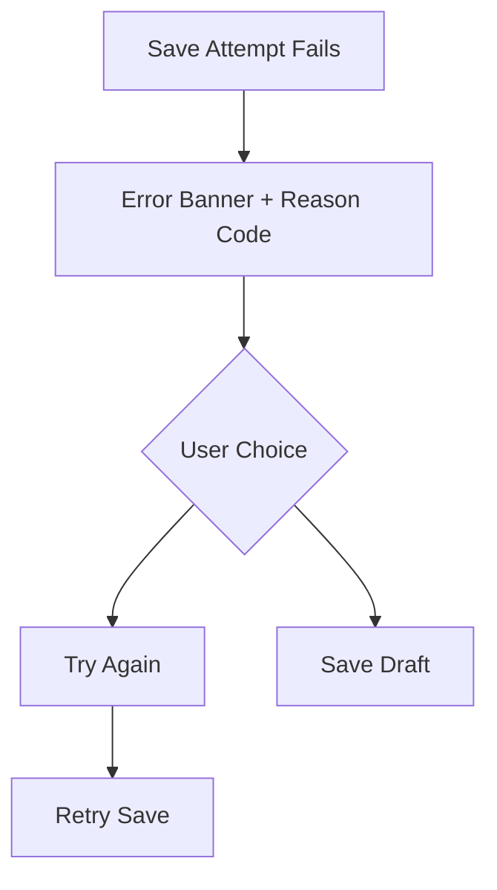
```mermaid
flowchart TD
  A[Save Attempt Fails] --> B[Error Banner + Reason Code]
  B --> C{User Choice}
  C --> D[Try Again]
  C --> E[Save Draft]
  D --> F[Retry Save]
```

## WF-12, Retry Flow, Group Computation Timeout
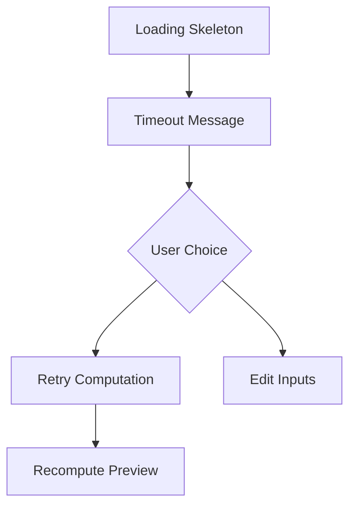
```mermaid
flowchart TD
  A[Loading Skeleton] --> B[Timeout Message]
  B --> C{User Choice}
  C --> D[Retry Computation]
  C --> E[Edit Inputs]
  D --> F[Recompute Preview]
```

## WF-13, Permission Denied, Admin-Only Action
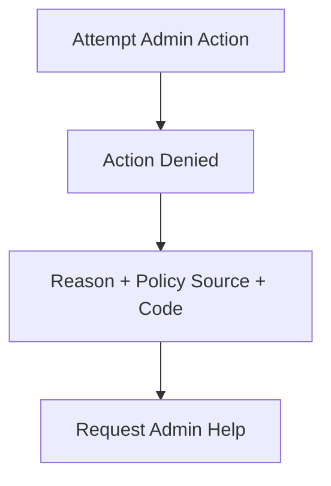
```mermaid
flowchart TD
  A[Attempt Admin Action] --> B[Action Denied]
  B --> C[Reason + Policy Source + Code]
  C --> D[Request Admin Help]
```

## WF-14, No Goal Exists, Implementation Blocked
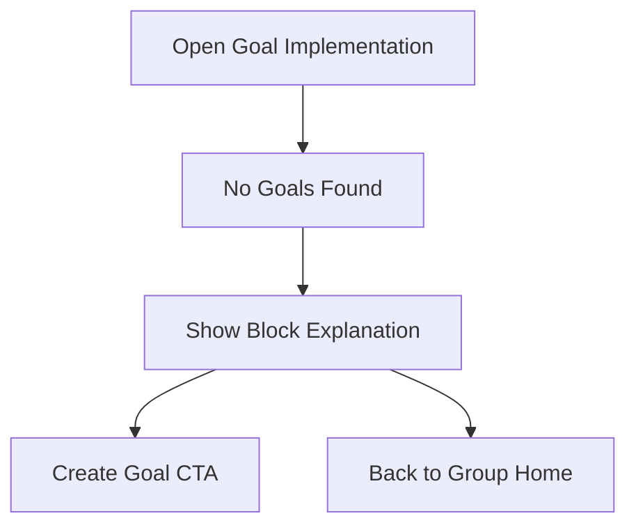
```mermaid
flowchart TD
  A[Open Goal Implementation] --> B[No Goals Found]
  B --> C[Show Block Explanation]
  C --> D[Create Goal CTA]
  C --> E[Back to Group Home]
```

## WF-15, Missing Trace Segment, Support View
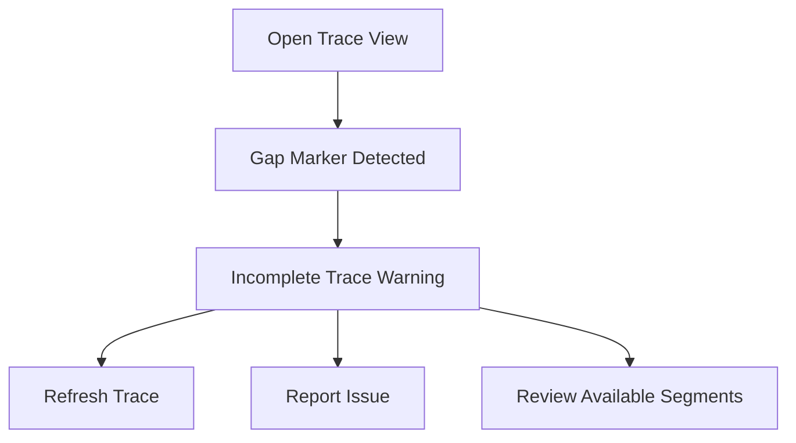
```mermaid
flowchart TD
  A[Open Trace View] --> B[Gap Marker Detected]
  B --> C[Incomplete Trace Warning]
  C --> D[Refresh Trace]
  C --> E[Report Issue]
  C --> F[Review Available Segments]
```

## WF-16, Network Offline / Reconnect State
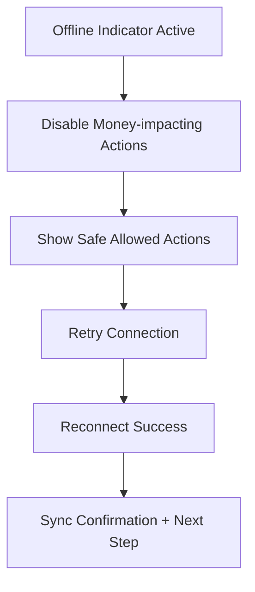
```mermaid
flowchart TD
  A[Offline Indicator Active] --> B[Disable Money-impacting Actions]
  B --> C[Show Safe Allowed Actions]
  C --> D[Retry Connection]
  D --> E[Reconnect Success]
  E --> F[Sync Confirmation + Next Step]
```
