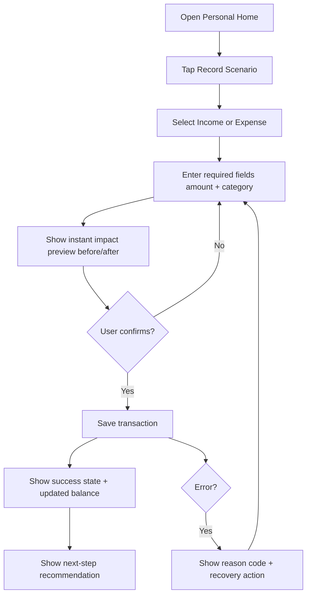
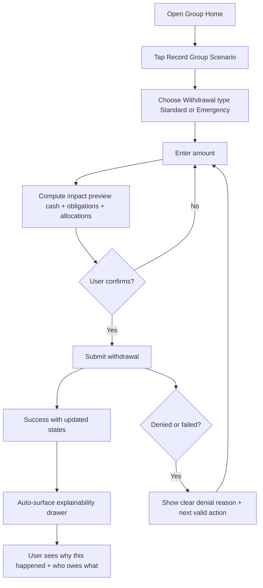
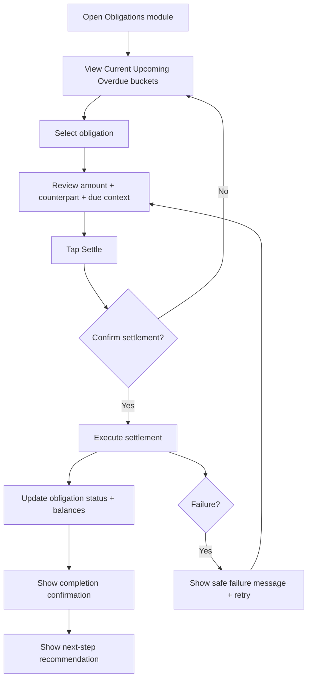

---
stepsCompleted:
  - 1
  - 2
  - 3
  - 4
  - 5
  - 6
  - 7
  - 8
  - 9
  - 10
  - 11
  - 12
  - 13
  - 14
lastStep: 14
inputDocuments:
  - /home/ratul/CodeBase/individual-finance/artifacts/planning-artifacts/prd.md
  - /home/ratul/CodeBase/individual-finance/artifacts/design/tokens/design-tokens.json
---

# UX Design Specification Individual Finance

**Author:** Ratul
**Date:** 2026-04-17

---

<!-- UX design content will be appended sequentially through collaborative workflow steps -->

## Executive Summary

### Project Vision

Individual Finance is a scenario-first web application that helps people and groups make high-trust money decisions with clarity. The product turns complex financial situations into deterministic, explainable outcomes so users can quickly understand why balances changed, who owes what, and what should happen next.

### Target Users

- Individuals managing personal cash flow, goals, and informal loan/lend obligations.
- Group members participating in shared funds and fairness-sensitive transactions.
- Group admins responsible for goal implementation, policy control, and governed financial actions.
- Support/admin reviewers who investigate disputes using event and trace logs.

### Key Design Challenges

- Making rule-heavy financial outcomes understandable in seconds, especially during urgent or stressful situations.
- Preserving strict separation between personal and group finance while keeping navigation and mental models simple.
- Designing admin-only and policy-governed actions with clear permission boundaries, denial reasons, and audit confidence.

### Design Opportunities

- Differentiate through an explainability-first UX pattern that turns opaque calculations into human-readable decision trails.
- Use scenario-driven entry points to reduce cognitive load and speed first-week activation.
- Build trust with obligation-forward timelines and transparent traceability, enabling faster dispute resolution and lower confusion.

## Core User Experience

### Defining Experience

The core experience for Individual Finance is personal daily logging that feels quick, calm, and reliable. Users should be able to capture income, expenses, and related obligation states in moments, while always understanding what changed and what action comes next. The experience centers on a repeatable clarity loop: scenario entry, impact preview, and guided next step.

### Platform Strategy

For MVP, the product is a responsive web app with mobile-first interaction patterns. Core member flows prioritize thumb-friendly interactions, fast form completion, and compact information hierarchy optimized for small screens. Admin and support surfaces must remain usable on desktop from day one. Desktop-specific enhancements (denser layouts, power-user shortcuts) are post-MVP.

### Effortless Interactions

- **Scenario entry:** users can initiate common financial actions with minimal cognitive load and reduced form friction.
- **Impact preview comprehension:** before confirmation, users can clearly understand balance and obligation impact in plain language.
- **Obligation settlement:** users can quickly identify what is due, settle obligations, and verify updated status without hunting through history.

### Critical Success Moments

- A user records a daily personal transaction in seconds and immediately sees a clean, updated state.
- A user previews impact before submitting and feels confident there are no hidden consequences.
- A user settles an obligation and can instantly confirm that everything is organized and under control.
- The make-or-break perception is: **“This is too organized and easy to manage everything.”**

### Experience Principles

- **Clarity over complexity:** every interaction should reduce confusion and reveal state changes plainly.
- **Mobile-first confidence:** critical financial actions must be easy, fast, and safe on small screens.
- **Preview before commitment:** users should understand impact before finalizing balance-affecting actions.
- **Actionable next steps:** after every important action, the UI should guide users to what needs attention next.

## Desired Emotional Response

### Primary Emotional Goals

Individual Finance should make users feel calm, in control, confident, and relieved. The emotional target is reduced money stress through immediate clarity and predictable outcomes. Users should leave each key interaction feeling that their financial state is understandable and manageable.

### Emotional Journey Mapping

- **First discovery:** users feel hopeful that this can replace fragmented notes, chat memory, and manual tracking.
- **During core actions:** users feel guided and safe, especially when entering transactions or reviewing impact previews.
- **After task completion:** users feel relief and confidence because the result is organized and explicit.
- **When returning:** users feel continuity and control, with no fear of hidden state changes.
- **When something goes wrong:** users still feel safe because the system explains exactly what happened and what to do next.

### Micro-Emotions

- Confidence instead of confusion, through plain-language previews and clear state transitions.
- Trust instead of skepticism, through deterministic explainability and transparent event history.
- Accomplishment instead of frustration, through fast completion of logging and settlement actions.
- Fairness reassurance in group contexts, especially during borrowing allocation and obligation updates.
- Steady momentum through speed and low-friction interaction patterns on mobile.

### Design Implications

- **Calm and control** → clean hierarchy, low-noise layouts, and predictable interaction patterns.
- **Confidence** → pre-confirmation impact previews and explicit post-action result states.
- **Trust and transparency** → always-available “why this happened” paths for balance-impacting outcomes.
- **Fairness** → clear group obligation breakdowns and visible rule-applied context.
- **Relief after errors** → actionable, human-readable failure messages with reason codes and safe recovery steps.

### Emotional Design Principles

- **Explain before uncertainty grows:** provide understandable context before and after critical actions.
- **Confidence by design:** remove ambiguity from balances, obligations, and next steps.
- **Safety in failure:** error states should preserve trust by showing what happened and how to recover.
- **Fairness is visible:** group outcomes must be transparent enough to reduce disputes.
- **Speed with clarity:** keep interactions fast without sacrificing comprehension.

## UX Pattern Analysis & Inspiration

### Inspiring Products Analysis

**bKash**  
bKash demonstrates trust-centered mobile financial UX with strong action clarity and familiar language. Its interaction model reduces hesitation by keeping core money actions visible, predictable, and fast, which aligns with Individual Finance’s mobile-first requirement and daily logging focus.

**Splitwise**  
Splitwise is a strong benchmark for shared-money clarity. It makes obligations legible through explicit participant-level breakdowns and straightforward settlement framing. This pattern maps directly to group fairness, “who owes what” visibility, and obligation resolution workflows in Individual Finance.

**Wise**  
Wise excels at transparency before commitment. Users see critical impact details before confirming transactions, which builds confidence and reduces uncertainty. This is highly relevant for deterministic impact previews and explainability-first group actions in Individual Finance.

### Transferable UX Patterns

**Navigation Patterns**
- **Action-first home surfaces (bKash):** prioritize frequent financial actions at top level for fast daily use.
- **Obligation-focused list structures (Splitwise):** group due/current/settled states for immediate comprehension.
- **Pre-commit detail checkpoints (Wise):** show outcome-impact summaries before confirmation.

**Interaction Patterns**
- **Low-friction quick entry (bKash):** reduce input burden for repeated personal logging tasks.
- **Clear settle-now affordances (Splitwise):** make repayment and obligation closure explicit and immediate.
- **Confidence previews (Wise):** explain “before vs after” impact to reduce anxiety on money-impacting actions.

**Visual Patterns**
- **Trust-first clarity (bKash):** clean hierarchy and restrained visual noise for financial confidence.
- **Readable debt allocation displays (Splitwise):** clear participant and amount mappings for fairness perception.
- **Transparent outcome framing (Wise):** plain-language summaries that support trust and control.

### Anti-Patterns to Avoid

- **Hidden financial logic:** opaque balance updates without explanation will increase confusion and disputes.
- **Over-nested flows for common actions:** too many taps for daily logging or settlement creates fatigue.
- **Ambiguous status language:** unclear labels for obligation states (due, partial, resolved) cause misinterpretation.
- **Confirmation without impact context:** users should never commit money actions without understanding outcome.
- **Decorative complexity in critical flows:** visual flair that competes with financial clarity undermines confidence.

### Design Inspiration Strategy

**What to Adopt**
- Action-first mobile layout patterns from bKash for daily personal logging.
- Obligation and settlement clarity structures from Splitwise for group workflows.
- Pre-confirmation impact transparency patterns from Wise for money-impacting actions.

**What to Adapt**
- Splitwise-style settlement patterns adapted for deterministic rule outputs and explainability traces.
- Wise-style previews adapted for group-specific fairness logic and obligation timeline updates.
- bKash-like quick-entry flows adapted for scenario-first routing across personal and group contexts.

**What to Avoid**
- Any pattern that hides why balances changed or defers explanation to support channels.
- Any interaction model that prioritizes novelty over confidence in critical financial actions.
- Any information architecture that blends personal and group ledgers into a single ambiguous context.

## Design System Foundation

### 1.1 Design System Choice

For Individual Finance, the selected foundation is a **themeable design system** using **Tailwind CSS + shadcn/ui-style component architecture + project design tokens**.

### Rationale for Selection

- It provides the best balance of **MVP speed** and **brand-level control** for a mobile-first fintech product.
- It supports strict clarity patterns needed for high-trust money interactions without locking the product into rigid visual defaults.
- It aligns directly with the existing token set already defined for color semantics, spacing, typography, motion, and component behavior.
- It enables progressive evolution from MVP into a more governed design system without major rework.

### Implementation Approach

- Use design tokens as the single source of truth for visual semantics and interaction consistency.
- Build a reusable component layer for core financial flows (scenario entry, impact preview, obligation cards, explainability panels).
- Apply mobile-first responsive primitives first, then extend to larger screens in later phases.
- Enforce accessibility and state consistency across all interactive components (idle, loading, success, failure, denied).

### Customization Strategy

- Keep base primitives stable and customize via token-driven theming rather than ad hoc per-screen styles.
- Prioritize custom patterns for differentiating areas: obligation settlement, rule explainability, and admin-governed actions.
- Avoid decorative customization in critical flows, optimize for confidence, readability, and speed.
- Define a phased expansion path: MVP component set first, then growth-phase additions for analytics, notifications, and advanced policy controls.

## 2. Core User Experience

### 2.1 Defining Experience

The defining experience for Individual Finance is: **log money fast, preview exact impact, and always leave with a clear next step**. This interaction should feel effortless enough for daily repetition while preserving confidence for balance-impacting decisions.

### 2.2 User Mental Model

Users currently operate with a mixed model of notes, memory, chat messages, and spreadsheets. They are not starting from a clean accounting framework, they are starting from fragmented records and uncertainty. The UX must bridge this by translating familiar money actions into structured, transparent outcomes without forcing accounting-heavy behavior.

### 2.3 Success Criteria

- **Next-step recommendation is always visible** after key actions.
- **Zero ambiguity in impact preview** before money-affecting confirmation.
- **Under 30 seconds to log a daily entry** for the common personal flow.

### 2.4 Novel UX Patterns

The product uses mostly familiar interaction patterns for speed of adoption, with one innovative twist:

- **Familiar patterns:** action-first cards, guided forms, explicit confirmation states, and obligation lists.
- **Innovative twist:** for high-impact group actions, the explainability drawer is surfaced proactively so users immediately see rule logic and outcome rationale without hunting for details.

### 2.5 Experience Mechanics

**1. Initiation**
- Users start from a scenario-first launcher or quick action on the home surface.
- Frequent actions remain visible and one-tap accessible on mobile.

**2. Interaction**
- Users enter only required data first, optional details are progressively disclosed.
- System computes and displays impact preview before final submission.

**3. Feedback**
- Users receive clear success states with updated balances and obligation status.
- If blocked or failed, users get human-readable reason + safe recovery path.

**4. Completion**
- Every completed flow ends with “what happens next” guidance.
- Users can immediately continue to suggested next actions (for example, settle obligation, review explanation, or add another daily record).

### 2.6 Component Sourcing Directive (MCP)

To accelerate implementation quality and consistency, component work should follow this rule:

- **Default behavior for agents:** use Magic MCP tools to source and adapt pre-built components before building from scratch.
- **Preferred order:** discover existing component -> adapt to tokens and UX rules -> implement custom only when required behavior is unavailable.
- **Governance:** all sourced components must conform to accessibility, mobile-first constraints, and the project's design token system.

## 2.7 Goal Implementation & Reservation System

### Goal Implementation Flow

**Core Rule:** Goal implementation can ONLY proceed from reserved money. This is a critical constraint that must be reflected in all UI flows.

**Implementation Flow States:**
1. **No Reservation Exists:** Display "No reserved money available" message prominently when no reservation exists for a goal.
2. **Reservation Required:** Admin must create a reservation BEFORE goal implementation can occur.
3. **Implementation Ready:** Once reservation exists, implementation proceeds from reserved funds only.

**UI Requirements:**
- Goal implementation button should be disabled or show appropriate messaging when no reservation exists.
- Clear messaging: "Reserve funds from members first to enable implementation" when no reservation exists.
- Progress indicator shows reservation status relative to goal target.

### Admin Reserve from Members

**New Admin Action:** "Reserve from Members" enables admins to allocate funds from member net balances toward a goal.

**Reservation Flow UI Components:**

1. **Member Lending Capacity Display**
   - Show each member's current lending capacity in the reservation flow
   - Lending capacity = net balance - reserved money
   - Display format: member name | lending capacity (prominently visible)

2. **Proportional Breakdown View**
   - Show proposed reservation amount broken down proportionally across members
   - Each member's proposed share displayed with percentage contribution
   - Visual representation of how reservation distributes across the group

3. **Capped Amount Calculation**
   - Display each member's capped reservation amount (based on lending capacity)
   - Show the lesser of proportional share vs. available lending capacity
   - Highlight members who have insufficient capacity for their proportional share

4. **Confirmation Summary**
   - Reservation confirmation screen with complete summary
   - Total reservation amount
   - Per-member breakdown with final amounts
   - Goal target progress indicator (moves upward when reservation created)

**Progress Bar Behavior:**
- When reservation is created, goal progress bar moves upward
- Display: "Reserved: $X / $Y goal target"
- Show percentage completion from reservation alone

## Visual Design Foundation

### Color System

No existing brand guidelines were provided, so the visual system adopts **Option A: Calm Trust Blue** as the primary theme, optimized for fintech trust, action confidence, and completion behavior.

**Core Palette**
- Primary: `#2563EB`
- Secondary: `#60A5FA`
- Accent: `#14B8A6`
- Surface: `#F8FAFC`
- Text: `#0F172A`

**CTA Strategy**
- Primary CTA default: `#2563EB`
- Primary CTA pressed: `#1D4ED8`
- Primary CTA text: `#FFFFFF`
- Principle: one consistent primary CTA color across flows to reinforce “visible next step” behavior.

**Semantic Mapping**
- Info/Explainability: blue family
- Success/Resolved: controlled green-teal family
- Warning/Upcoming risk: amber family
- Error/Blocked: restrained red family
- Admin-governed actions: distinct but low-noise indigo variant

### Typography System

Typography is optimized for mobile readability, confidence, and fast scanning in money-critical interfaces.

- Heading family: `Sora` (clear hierarchy, modern trust tone)
- Body family: `Manrope` (high legibility for dense mobile UI)
- Numeric/data family: `IBM Plex Mono` (tabular stability for amounts and balances)

**Type Scale**
- Body base: 16px
- Supporting sizes: 12, 14, 16, 18, 20, 24, 30
- Line-height: 1.5 body baseline for readability
- Priority: ensure amount readability and state label clarity over decorative typography

### Monetary Value Display

Monetary values in Individual Finance support floating point amounts up to **2 decimal places** to handle real-world financial transactions (e.g., 100.50, 49.99, 1000.00).

**Precision Rules**
- All monetary values store and display up to 2 decimal places.
- Input validation accepts decimals (e.g., "100.50") and whole numbers (e.g., "100").
- Backend calculations maintain precision to 2 decimal places, no floating point rounding errors.

**Display Formatting**
- Use `IBM Plex Mono` (numeric/data font) for all currency values and amounts.
- Display format: `#,###.##` (locale-aware thousands separator, always show 2 decimal places).
- Examples: `1,234.56`, `100.00`, `0.50`.
- Currency symbol (if shown) precedes the amount with consistent spacing.

**Amount Alignment**
- Right-align all numeric amounts in tables, lists, and cards for column readability.
- Use tabular figure spacing (`tnum` OpenType feature) for consistent digit width.
- Ensure consistent decimal alignment across adjacent values.

**Input Fields**
- Amount inputs allow decimal entry (e.g., typing "100.5" auto-formats to "100.50").
- Display validation feedback inline near the amount field.
- Support common shorthand: period or dot for decimal entry (100.50 vs 100,50 based on locale).

**Impact Preview Calculations**
- All impact previews compute and display with full 2 decimal place precision.
- Show clear before/after deltas with proper decimal formatting.
- Avoid rounding in intermediate calculations, round final display values only.

### Spacing & Layout Foundation

The layout system uses a mobile-first, low-friction structure focused on fast action and low cognitive overhead.

- Base spacing unit: 8px system (with 4px micro-adjustments)
- Touch minimums: 44px target size for interactive controls
- Layout rhythm: compact but breathable card stacking for mobile viewport
- Information hierarchy: action-first placement, then impact preview, then next-step guidance
- Progressive disclosure: required fields first, optional detail revealed as needed

**Layout Principles**
- Keep core actions above the fold where possible
- Preserve strict personal/group context boundaries in screen structure
- End key flows with explicit next-step visibility

### Accessibility Considerations

- Enforce WCAG-compliant contrast for text and controls in light and dark modes.
- Never rely on color alone for financial state meaning, pair with icon/text labels.
- Maintain keyboard-operable and screen-reader-friendly semantics for critical actions.
- Keep error and denial states human-readable with reason + recovery guidance.
- Ensure visual consistency of semantic colors to preserve trust and reduce confusion.

**Risk Controls**
- Avoid overusing warm colors in primary actions to reduce anxiety.
- Avoid inconsistent semantic color use across modules.
- Avoid decorative gradients in money-critical decision screens.

## Design Direction Decision

### Design Directions Explored

A multi-variation mobile-first direction set was explored to validate layout, action hierarchy, preview behavior, and obligation visibility for Individual Finance. The exploration covered action-first dashboards, preview-first transaction flows, timeline-centric structures, and obligation-heavy group views, all aligned with the Calm Trust Blue visual foundation.

### Chosen Direction

The selected direction is a composed approach:

- **Base:** Direction 1 (Action-First Dashboard)
- **Integrated element:** Direction 3 (Preview-First transaction impact block)
- **Integrated element:** Direction 4 (Obligation Command Center module)

### Design Rationale

This combination best supports the defined success criteria and emotional goals:

- Direction 1 preserves fast daily logging and clear primary CTA behavior.
- Direction 3 ensures zero ambiguity in impact preview before financial commitment.
- Direction 4 strengthens obligation visibility and settlement velocity.
- Together, the composition reinforces the product promise: organized, easy, and confidence-building money management.

### Implementation Approach

- Use Direction 1 as the screen architecture and default navigation hierarchy.
- Embed Direction 3 preview pattern into all money-affecting create/update flows.
- Embed Direction 4 obligation module as a persistent or quickly accessible section in relevant personal/group surfaces.
- Maintain consistent component sourcing rule: discover via Magic MCP first, adapt with project tokens, and build custom only when necessary.
- Validate with mobile usability checks against core targets: under-30s daily logging, visible next step, and high-confidence impact comprehension.

## User Journey Flows

### Journey 1, Personal Daily Logging (Core)

This flow optimizes for under-30-second entry, clear impact preview, and always-visible next-step guidance.

### Journey 2, Group Withdrawal with Explainability

This flow ensures confidence during high-impact group actions through deterministic preview and immediate explanation access.

### Journey 3, Obligation Settlement Flow

This flow prioritizes rapid due-state resolution with clear completion feedback.

### Journey Patterns

- Scenario-first entry reduces cognitive load and accelerates action.
- Impact preview before commit is mandatory for trust-critical actions.
- Every flow ends with explicit “what next” guidance.
- Error states always include reason + recovery path.
- Explainability is embedded, not hidden behind support workflows.

### Flow Optimization Principles

- Prioritize shortest path to user value for frequent actions.
- Keep required fields first, optional detail second.
- Maintain consistent state feedback: loading, success, error, denied.
- Minimize context switching between personal and group modules.
- Preserve confidence over novelty in all money-affecting interactions.

## Component Strategy

### Design System Components

The product will use a **themeable Tailwind + shadcn/ui foundation** as the default component baseline.

**Core components available from shadcn/ui (use directly):**
- Button, Input, Textarea, Label, Select, Checkbox, Radio Group, Switch
- Card, Badge, Alert, Separator, Skeleton
- Tabs, Accordion, Dialog, Drawer, Popover, Tooltip
- Sheet, Dropdown Menu, Command, Table, Pagination
- Toast/Sonner integration patterns

**Policy for agents:**
- Agents should install and use available **shadcn components first** for speed, accessibility, and consistency.
- Agents should avoid rebuilding solved primitives unless required by behavior gaps.

### Custom Components

The following components are domain-specific and should be built as custom composites (using shadcn primitives + project tokens):

1. **ScenarioLauncher**
   - Purpose: fast entry point for common personal/group actions.
   - Key states: default, focused, loading, disabled.

2. **ImpactPreviewCard**
   - Purpose: explain before/after impact before confirmation.
   - Key states: computing, ready, changed-input, error.
   - **Monetary precision:** display all amounts with 2 decimal places, right-aligned in tabular format.
   - **Decimal handling:** show proper decimal alignment in before/after comparisons.

3. **ObligationCommandCenter**
   - Purpose: show current/upcoming/overdue obligations with fast settle actions.
   - Key states: filtered views, empty, overdue emphasis, settled confirmation.

4. **ExplainabilityDrawer**
   - Purpose: show deterministic “why this happened” traces.
   - Key states: collapsed, expanded, loading trace, missing-trace warning.

5. **NextStepRecommendationPanel**
   - Purpose: always-visible guidance for immediate user continuation.
   - Key states: single action, multiple actions, no action.

6. **PermissionGuardAction**
   - Purpose: render admin-only actions with reasoned denial messaging.
   - Key states: allowed, denied with reason code, policy-updated.

7. **MemberLendingCapacityCard**
   - Purpose: display member's net balance, reserved money, and lending capacity.
   - Key states: active, inactive (is_viable=false), loading.
   - **is_viable indicator:** visual marker for inactive members (excluded from calculations but historical data visible).

8. **ReservationFlowWizard**
   - Purpose: multi-step admin flow for reserving funds from members.
   - Key states: member selection, proportional calculation, capped amounts review, confirmation.
   - **UI displays:** lending capacity per member, proportional breakdown, capped amounts, progress bar update.

9. **GoalImplementationPanel**
   - Purpose: handle goal implementation with reservation-only constraint.
   - Key states: no-reservation (disabled), reservation-ready, implementing, completed.
   - **UI behavior:** show "No reserved money available" when no reservation, require reservation before implementation.

### Component Implementation Strategy

- **Default sourcing order (mandatory):**
  1) Install/use shadcn component if available.
  2) Use Magic MCP to discover and adapt pre-built component patterns.
  3) Build custom only when behavior is not satisfied by 1 or 2.

- **Magic MCP directive:**
  - Agents should use Magic MCP for both component discovery and prebuilt component adaptation.
  - All imported/adapted components must be mapped to project tokens and UX constraints.

- **Quality constraints:**
  - Mobile-first interaction behavior.
  - Accessibility-first states and labels.
  - Deterministic state rendering for financial outcomes.
  - No decorative complexity in money-critical flows.

### Implementation Roadmap

**Phase 1, Core Journey Components**
- shadcn primitives setup and installation.
- ScenarioLauncher
- ImpactPreviewCard
- NextStepRecommendationPanel

**Phase 2, Group Trust Components**
- ObligationCommandCenter
- ExplainabilityDrawer
- PermissionGuardAction

**Phase 3, Scaling and Hardening**
- Advanced filters, timeline enhancements, and analytics surfaces.
- Expanded component variants for edge-case and support workflows.
- Performance and accessibility hardening passes.

## UX Consistency Patterns

### Button Hierarchy

- **Primary button:** reserved for the single most important next action on each screen (usually one per view).
- **Secondary button:** supportive actions such as cancel, back, or view details.
- **Tertiary/text action:** low-risk and non-blocking interactions.
- **Danger actions:** visually distinct and always require explicit confirmation.
- **Rule:** maintain one consistent primary CTA color and placement pattern to reinforce “next-step always visible.”

### Feedback Patterns

- **Success feedback:** immediate confirmation + updated balance/obligation state + next-step recommendation.
- **Error feedback:** plain-language explanation + reason code + clear recovery action.
- **Warning feedback:** used for risk states (upcoming due, policy constraints) without panic tone.
- **Info feedback:** explainability and rule-context support.
- **State consistency:** all money-affecting flows must support idle, loading, success, denied, and failure states.

### Form Patterns

- Required fields first, optional fields progressively disclosed.
- Input order follows user mental model (scenario -> amount -> context -> preview -> confirm).
- Inline validation appears near fields with concise fix guidance.
- Submissions are idempotent and protected from duplicate taps.
- For high-impact actions, pre-confirmation preview is mandatory.

**Monetary Input Validation**
- Amount fields accept floating point values up to 2 decimal places.
- Accepted formats: "100", "100.00", "100.5", "100.50".
- Reject inputs with more than 2 decimal places (e.g., "100.555").
- Reject negative values for amounts in spending/expense contexts.
- Display inline validation feedback immediately below the amount field.
- Use numeric keyboard (`inputmode="decimal"`) on mobile for amount fields.

**Transaction ID Field**
- All money-related forms (transactions, reservations, goal implementations) should include an optional transaction_id field.
- Display as optional text input with placeholder "Enter transaction ID (optional)"
- Transaction ID field should not block form submission when empty.
- Use case: allows external system reference or manual ID entry for audit trails.

### Member Status Indicators

**is_viable Indicator**
- Members with `is_viable = false` should be visually marked as inactive/excluded.
- Display treatment: muted appearance, strikethrough on name, or badge saying "Inactive" or "Excluded".
- Historical data visibility: show past transactions and balances for inactive members but clearly mark them as historical.
- Calculation exclusion: exclude inactive members from group calculations (reservations, goal funding, etc.).
- UI should display warning or note: "Some members are inactive and excluded from calculations" when relevant.

### Member Profile & Net Balance Display

**Lending Capacity Display in Profile View**
- Member profile or net balance view should display three key values:
  1. **Net Balance:** total deposits - total withdrawals - borrowing allocations + returned withdrawals
  2. **Reserved Money:** amount reserved for goals (reduces lending capacity)
  3. **Lending Capacity:** net balance - reserved money (available amount for group borrowing)

**Display Layout:**
- Present as horizontal card or stacked values in profile summary
- Lending capacity should be prominently highlighted as it's critical for group participation
- Formula hint: "Lending capacity = Net balance - Reserved money" shown as tooltip or help text

**Visual Priority:**
- Net balance: primary large display
- Reserved money: secondary supporting value
- Lending capacity: prominent indicator (possibly color-coded based on amount available)

### Navigation Patterns

- Mobile-first bottom navigation with stable top-level destinations.
- Personal and Group contexts remain clearly separated at navigation level.
- Scenario launcher remains consistently reachable from core surfaces.
- Back behavior is predictable and preserves state where appropriate.
- High-friction transitions are avoided in frequent daily flows.

### Additional Patterns

**Modal and Overlay Patterns**
- Use dialogs/sheets for confirmations and policy-sensitive actions.
- Destructive or admin-governed operations always include explicit confirmation copy.

**Empty, Loading, and Retry Patterns**
- Empty states are actionable, never dead ends.
- Loading states provide progress reassurance for deterministic computations.
- Retry paths are always available with no ambiguous failure outcomes.

**Search and Filter Patterns**
- Obligation and timeline surfaces support quick filter presets (current, upcoming, overdue).
- Filter chips preserve clarity and avoid overwhelming parameter complexity in MVP.

### System Integration Rules

- Agents should install and use **shadcn/ui components first** where available.
- Agents should use **Magic MCP** to discover and adapt pre-built components before custom implementation.
- Custom components must inherit project tokens and consistency rules.
- Accessibility and mobile-first behavior are non-negotiable acceptance conditions.

## Responsive Design & Accessibility

### Responsive Strategy

The responsive strategy is **mobile-first primary**, with tablet optimization and desktop as a secondary support surface. Core financial actions are designed for one-hand usage and fast completion on small screens, while larger screens progressively enhance information density.

- Mobile (primary): action-first hierarchy and touch-optimized interactions.
- Tablet (secondary): expanded cards, side context panels where useful, preserved touch ergonomics.
- Desktop (secondary): denser support/admin views without changing core interaction logic.

### Breakpoint Strategy

- **Mobile:** 320px - 767px
- **Tablet:** 768px - 1023px
- **Desktop:** 1024px+

Design and implementation should follow mobile-first breakpoints with progressive enhancement at larger sizes. Breakpoints should prioritize behavior consistency over visual novelty.

### Accessibility Strategy

Target compliance level is **WCAG 2.2 AA**.

Key requirements:
- Contrast-compliant text and controls in all states.
- Keyboard accessibility for critical navigation and action flows.
- Screen-reader-compatible labels and state announcements.
- Minimum touch target size of 44x44px for interactive controls.
- Non-color cues for important status communication (icons/text with color).

### Testing Strategy

**Responsive Testing**
- Validate key journeys on real devices across representative mobile sizes.
- Confirm tablet and desktop adaptations preserve flow clarity.
- Test browser compatibility on major modern browsers.

**Accessibility Testing**
- Automated accessibility linting and contrast checks.
- Keyboard-only navigation testing for all critical flows.
- Screen reader testing for key transaction, preview, and settlement interactions.
- Manual verification of focus order, error messaging, and state announcements.

### Implementation Guidelines

- Build layouts with mobile-first responsive primitives and relative sizing.
- Preserve one-primary-action hierarchy at all breakpoints.
- Keep form and feedback patterns consistent across screen sizes.
- Use semantic HTML and ARIA only where necessary for clarity.
- Ensure custom components sourced via Magic MCP and built on shadcn primitives meet the same accessibility standards.
- Treat responsive and accessibility checks as release-gate criteria for money-impacting flows.
